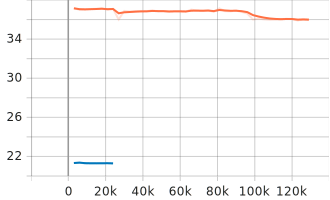

# Advanced Topics in Machine Learning Coursework

> This implementation effectively integrates language model generation capabilities with multidimensional quality
evaluation, providing an innovative solution for natural language generation tasks.

## 1 Installation Step

### 1.1 Clone Project (<mark>Recommend Baidu Net-disk Method</mark>)

1. Github (no gpt2-jokes train models): `git clone https://github.com/DjyBrandon/atml-cw`
2. Baidu Net-disk (including gpt2-jokes train models): [download full code](https://pan.baidu.com/s/1SQGKoOBQICSpAwXByzOFkQ?pwd=f7rw)

### 1.2 Install Dependencies

```shell
pip install -r requirements.txt
```

### 1.3 Run Program

Run program using [execute examples](#execute-examples) commands.

## 2 Execute Examples

### 2.1 Modified Model

```shell
python modified_generate_joke.py "How to split the sky into two parts?" --max_length 100 --num_return_sequences 10 --temperature 0.7
```

```shell
python modified_generate_joke.py "What's the difference between a human and a cat?" --max_length 100 --num_return_sequences 10 --temperature 0.7
```

```shell
python modified_generate_joke.py "What part of the chicken is chicken fillet?" --max_length 100 --num_return_sequences 10 --temperature 0.7
```

```shell
python modified_generate_joke.py "Who is faster in man and rabbit?" --max_length 100 --num_return_sequences 10 --temperature 0.7
```

```shell
python modified_generate_joke.py "Who flies higher, cats or people?" --max_length 100 --num_return_sequences 10 --temperature 0.7
```

```shell
python modified_generate_joke.py "What about the washing machine for cooking?" --max_length 100 --num_return_sequences 10 --temperature 0.7
```

```shell
python modified_generate_joke.py "What about eat pizza with chopsticks?" --max_length 100 --num_return_sequences 10 --temperature 0.7
```

```shell
python modified_generate_joke.py "How can I run faster than a plane?" --max_length 100 --num_return_sequences 10 --temperature 0.7
```

```shell
python modified_generate_joke.py "What do you call a tomato in space?" --max_length 100 --num_return_sequences 10 --temperature 0.7
```

### 2.2 Origin Model

```shell
python origin_generate_joke.py "How to split the sky into two parts?" --max_length 100 --num_return_sequences 10 --temperature 0.7
```

```shell
python origin_generate_joke.py "What's the difference between a human and a cat?" --max_length 100 --num_return_sequences 10 --temperature 0.7
```

```shell
python origin_generate_joke.py "What part of the chicken is chicken fillet?" --max_length 100 --num_return_sequences 10 --temperature 0.7
```

```shell
python origin_generate_joke.py "Who is faster in man and rabbit?" --max_length 100 --num_return_sequences 10 --temperature 0.7
```

```shell
python origin_generate_joke.py "Who flies higher, cats or people?" --max_length 100 --num_return_sequences 10 --temperature 0.7
```

```shell
python origin_generate_joke.py "What about the washing machine for cooking?" --max_length 100 --num_return_sequences 10 --temperature 0.7
```

```shell
python origin_generate_joke.py "What about eat pizza with chopsticks?" --max_length 100 --num_return_sequences 10 --temperature 0.7
```

```shell
python origin_generate_joke.py "How can I run faster than a plane?" --max_length 100 --num_return_sequences 10 --temperature 0.7
```

```shell
python origin_generate_joke.py "What do you call a tomato in space?" --max_length 100 --num_return_sequences 10 --temperature 0.7
```

## 2.3 Result Examples

1. Joke Generation Result Examples

| Joke No. |                                                  Joke                                                   |
|:--------:|:-------------------------------------------------------------------------------------------------------:|
|    1     |                               You take the left side and the right side.                                |
|    2     |                                 You put a piece of toast in the middle.                                 |
|    3     |                       You put a mirror in the corner and a piece of paper in it.                        |
|    4     |                             With your left hand you can see the whole sky !                             |
|    5     | I'll start with the part that has the lightbulb, and the rest of the parts that don't have light bulbs. |
|    6     |                                               You can't !                                               |
|    7     |                                        Put a pencil to the left.                                        |
|    8     |                                    You look down and see the earth.                                     |

2. Generation Result Score Examples

|  Joke  | Perplexity | BERTScore | Distinct1 | Distinct2 | Length | Score  |
|:------:|:----------:|:---------:|:---------:|:---------:|:------:|:------:|
| Joke 1 |  11.3766   |  0.8604   |  0.8889   |    1.0    |   42   | 0.4277 |
| Joke 2 |  13.3763   |  0.8630   |    1.0    |    1.0    |   39   | 0.4980 |
| Joke 3 |  14.4243   |  0.8594   |  0.8571   |    1.0    |   58   | 0.3655 |
| Joke 4 |  13.3473   |  0.8713   |    1.0    |    1.0    |   46   | 0.6113 |
| Joke 5 |   7.5311   |  0.8480   |    0.8    |    1.0    |  103   | 0.4286 |
| Joke 6 |  35.3056   |  0.8496   |    1.0    |    1.0    |   10   | 0.1627 |
| Joke 7 |  23.9330   |  0.8611   |    1.0    |    1.0    |   25   | 0.3623 |
| Joke 8 |  25.5513   |  0.8661   |    1.0    |    1.0    |   32   | 0.4275 |

## 3 Project Structure

```text
atml-cw:
│  cached_lm_GPT2Tokenizer_128_processed_jokes.txt
│  command.txt
│  filter_joke.py
│  modified_generate_joke.py
│  modified_train_joke.py
│  origin_generate_joke.py
│  origin_train_joke.py
│  README.md
│  requirements.txt
│
├─data
│  │  processed_jokes.txt
│  │  sensitive_words.txt
│  │  shortjokes.csv
│  │  
│  └─origin
│          eval_jokes.txt
│          train_jokes.txt
│
├─gpt2-jokes
│  ├─modified
│  │  │  config.json
│  │  │  generation_config.json
│  │  │  merges.txt
│  │  │  model.safetensors
│  │  │  special_tokens_map.json
│  │  │  tokenizer_config.json
│  │  │  vocab.json
│  │  │  
│  │  ├─checkpoint-129000
│  │  │
│  │  └─checkpoint-130695
│  │
│  └─origin
│      │  config.json
│      │  generation_config.json
│      │  merges.txt
│      │  model.safetensors
│      │  special_tokens_map.json
│      │  tokenizer_config.json
│      │  vocab.json
│      │
│      ├─checkpoint-24000
│      │
│      └─checkpoint-24096
│
├─logs
│  ├─modified
│  │      events.out.tfevents.1734459492.Brandon.7537.0
│  │
│  └─origin
│         events.out.tfevents.1734494385.friedorange.10572.0
│
└─train-results
    ├─png
    │
    └─svg
```

## 4 Tensorboard Result

1. **Execute**: `tensorboard --logdir=logs`
2. **Access**: `http://localhost:6006/`

### 4.1 Train Results


### 4.2 Eval Results




# Author

This project is developed and maintained by:

- **Name** (Jiaxin Tang): [GitHub Profile Link](https://github.com/scxjt2)
- **Name** (Jiayi Dong): [GitHub Profile Link](https://github.com/DjyBrandon)
- **Name** (Ximing Cai): [GitHub Profile Link](https://github.com/19871190360)

# License

This project is licensed under the [Apache-2.0 License](LICENSE).